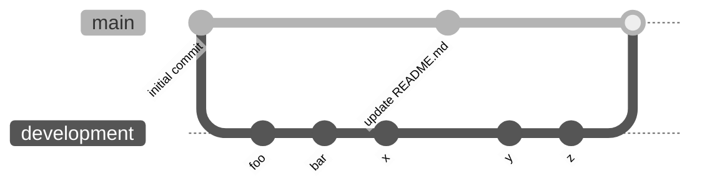

# laaCAD

yes, I want to recreate simple AutoCAD clone, using SvelteKit/TypeScript.

visit the `development` branch for the beta code (not complete, is work in progress)

```mermaid
%%{init: {'theme':'neutral'}}%%
gitGraph
    commit id:"initial commit"
    
    branch development
    checkout development
        commit id: "foo"
        commit id: "bar"
        commit id: "x"
    
    checkout main
        commit id:"update README.md"
    checkout development
        commit id: "y"
        commit id: "z"
    checkout main
    merge development
```
